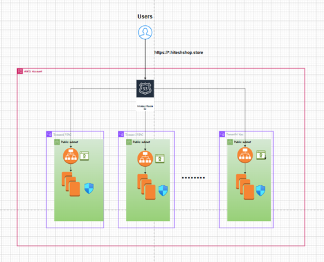

---

# Multi-Tenant AWS Infrastructure with Terraform

This project provisions isolated infrastructure for each tenant using Terraform modules. Each tenant gets:

* A dedicated VPC and public subnets
* A public Application Load Balancer (ALB) with SSL
* An EC2 instance running NGINX
* DNS record in Route53
* Validated ACM certificate for HTTPS

## Structure

```
root/
├── modules/
│   └── tenant/
│       └── main.tf (VPC, Subnet, IGW, ALB, EC2, Route53)
├── main.tf
├── variables.tf
├── terraform.tfvars
├── outputs.tf
└── README.md
```

## How to Use

---

### 1. Configure Variables

Update the `terraform.tfvars` file with your tenant configurations:

```hcl
tenants = [
  {
    tenant_name     = "tenant1"
    domain_name     = "tenant1.hiteshshop.store"
    vpc_cidr        = "10.8.0.0/16"
  },
  {
    tenant_name     = "tenant2"
    domain_name     = "tenant2.hiteshshop.store"
    vpc_cidr        = "10.9.0.0/16"
  }
]
hosted_zone_id  = "Z3P5QSUBK4POTI"
````

---

### 2. Run Terraform Commands

Use the following Terraform commands for provisioning:

```bash
terraform fmt                                 # Format Terraform files
terraform validate                            # Validate configuration
terraform plan -var-file=terraform.tfvars     # Preview the changes
terraform apply -var-file=terraform.tfvars    # Apply the infrastructure
```

---

### 3. Access Tenant Applications

After deployment, your tenants will be accessible via their respective subdomains. Example:

* `https://tenant1.hiteshshop.store`
* `https://tenant2.hiteshshop.store`

---

## Onboarding a New Tenant

To add a new tenant to the infrastructure:

1. **Update `terraform.tfvars`:**

Add a new tenant entry:

```hcl
{
  tenant_name     = "tenant3"
  domain_name     = "tenant3.hiteshshop.store"
  vpc_cidr        = "10.10.0.0/16"
}
```

2. **Deploy with Terraform:**

```bash
terraform plan -var-file=terraform.tfvars
terraform apply -var-file=terraform.tfvars
```

3. **Verify the Application:**

After successful provisioning, access the new tenant application at:

```bash
https://tenant3.hiteshshop.store
```

---

This setup supports seamless multi-tenant onboarding with minimal changes and ensures tenant isolation using modular VPC and ALB per tenant.

---

## Architecture




